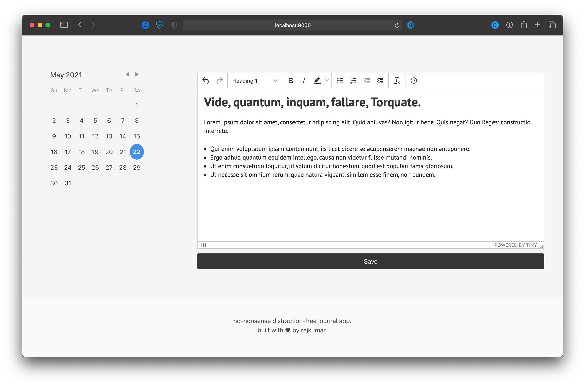

## Work Diary

a no-nonsense distraction-free journal app.



## Host it yourself

- Clone this repository
- Install the PHP packages 
```shell script
composer install
```
- Install React packages
```shell script
npm install
```
- Compile JS/CSS
```shell script
npm run prod
```
- Copy the env file and tweak as you need
```shell script
cp .env.example .env
vim .env
```
- Run the database migrations
```shell script
php artisan migrate
```
- Finally, configure your webserver(apache/nginx) to serve from public/
